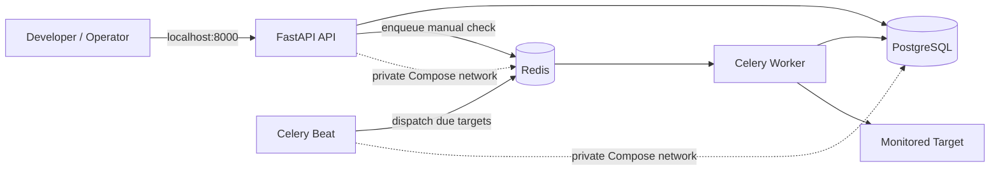
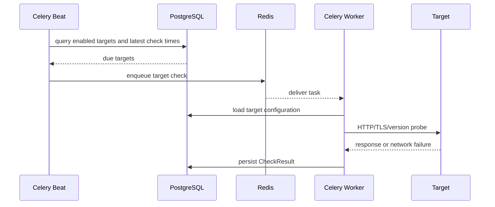
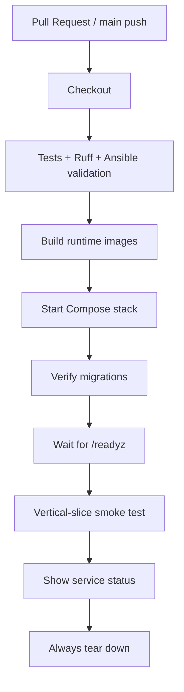

# Ops Appliance Architecture

## Purpose

`ops-appliance` is a deliberately small monitoring application designed to expose meaningful operational boundaries for DevOps and SRE practice.

The application is not intended to compete with mature monitoring products. Its purpose is to demonstrate how a production-style service can be deployed, observed, tested, failed, recovered, and evolved.

## System context

A customer-deployed version of the appliance would sit inside a network and monitor endpoints that may not be reachable from the public internet.

Examples:

- `https://internal-api.customer.local/health`
- `https://portal.customer.local`
- `https://api.customer.local/version`

For v0.1, deterministic local targets such as `http://api:8000/healthz` are used so testing does not depend on external internet access.


## Runtime architecture




## v0.2 Linux appliance runtime

v0.2 preserves the same application process boundaries while introducing a production-style Linux deployment model.

```text
Mac / operator
     |
     | SSH
     | HTTP :8000
     v
+---------------------------+
| Ubuntu 26.04 LTS          |
|                           |
| UFW                       |
|   +-- OpenSSH allowed     |
|   +-- TCP/8000 allowed    |
|                           |
| systemd --user            |
| (opsappliance, lingering) |
|          |                |
|          v                |
|   rootless Podman         |
|          |                |
|          +-- ops-api      |-- host TCP/8000
|          +-- ops-worker   |
|          +-- ops-beat     |
|          +-- ops-postgres |-- persistent volume
|          +-- ops-redis    |-- ephemeral
|                           |
+---------------------------+
```

Ansible owns appliance configuration after the initial Ubuntu installation and SSH bootstrap. It configures the host, firewall, rootless Podman runtime, Quadlet definitions, application configuration, database migrations, and service startup.

Quadlet definitions describe the Podman resources. systemd's Quadlet generator converts those definitions into user services, and systemd supervises the resulting containers.

All five services share a private Podman network named `ops-appliance`. Only the API publishes a host port. PostgreSQL and Redis remain reachable only from containers on the private network.

PostgreSQL uses the persistent `ops-postgres-data` volume. Redis is intentionally ephemeral because it coordinates work but is not the application's source of truth.

Docker Compose remains the development and CI runtime. The Linux appliance changes the deployment and supervision model without redesigning the application itself.


## Component responsibilities

| Component | Responsibility | Durable? | Host-published? |
| --- | --- | --- | --- |
| FastAPI API | target management, history, health/readiness, manual check requests | no | yes, `127.0.0.1:8000` |
| PostgreSQL | source of truth for targets and historical check results | yes | no |
| Redis | transient Celery broker and coordination | no | no |
| Celery Worker | executes probes and persists results | no | no |
| Celery Beat | triggers recurring due-target dispatch | no | no |
| Migrate | applies Alembic schema migrations before app startup | no | no |
| Dev container | pytest/Ruff/smoke tooling only | no | no |


## Monitoring flow

A recurring check follows this path:



Manual checks use the same worker path but are initiated by the API instead of the scheduler.


## State and durability

### PostgreSQL is durable state

PostgreSQL stores:

- target definitions
- enabled/disabled state
- monitoring intervals
- expected status codes
- TLS warning thresholds
- optional version URLs
- historical check results

If Redis disappears, this information remains intact.


### Redis is transient infrastructure

Redis is used as a Celery message broker. It coordinates work but is not the source of truth.

v0.1 intentionally configures Redis without persistence. Losing Redis may lose queued work, but it must not erase monitoring configuration or historical results.

This makes the recovery boundary explicit:

```text
Redis loss -> transient work may be lost
PostgreSQL loss -> durable application state is lost
```

## Process isolation

API, worker, and Beat are separate processes even though they share the same runtime image.

That separation is intentional:

- worker failure does not inherently stop the API
- scheduler failure does not inherently stop the worker
- API failure does not erase durable monitoring state
- each process can later be restarted, scaled, or supervised independently

The shared image reduces build duplication without collapsing runtime responsibilities.


## Networking

The project has two runtime networking models.


### Development / CI

Docker Compose creates a private bridge network named `backend`.

```text
Developer host
  |
  +-- 127.0.0.1:8000 -> API

Private Compose network
  +-- PostgreSQL:5432
  +-- Redis:6379
  +-- API:8000
  +-- Worker
  +-- Beat
  +-- Migrate
```

PostgreSQL and Redis are not published to the developer host. The API is bound to loopback for the local development workflow.


### Linux appliance

The appliance uses a private rootless Podman network named `ops-appliance`.

```text
Ubuntu host
  |
  +-- TCP/8000 -> ops-api

Private Podman network: ops-appliance
  +-- ops-api:8000
  +-- ops-postgres:5432
  +-- ops-redis:6379
  +-- ops-worker
  +-- ops-beat
```

Only the API publishes a host port. PostgreSQL and Redis remain internal to the Podman network.

UFW provides the host-level exposure policy:

- deny incoming traffic by default
- allow outgoing traffic
- allow OpenSSH
- allow TCP/8000 for the appliance API

This keeps the database and broker off the host network while still allowing the operator to reach the API.


## Container design

The custom application image uses a multi-stage Dockerfile.

### `runtime` stage

Used by:

- API
- worker
- Beat
- migration job

Properties:

- pinned Python 3.12 base
- application dependencies only
- non-root UID/GID `10001`
- no pytest or Ruff
- no embedded secrets


### `dev` stage

Used only for on-demand development commands.

Adds:

- tests
- pytest
- pytest-asyncio
- Ruff

This lets a fresh clone run `make check` using Docker without polluting the runtime image with development tooling.


## Health model

### `/healthz` — liveness

Answers:

> Is the API process alive?

A dependency failure should not automatically make liveness fail. Otherwise an orchestrator could repeatedly restart a healthy API process because a database or broker is down.


### `/readyz` — readiness

Answers:

> Can the API perform useful work right now?

PostgreSQL is required for normal API responsibility, so database loss makes the API not ready.

Redis is reported independently. Read-only operations can remain useful while the queue is unavailable, so Redis degradation does not automatically make every API operation unusable.


## Probe semantics

The worker supports:

- HTTP status checks
- latency measurement
- TLS validity checks
- TLS expiration calculation
- optional version endpoint retrieval

Expected failures are normalized as data.

Examples:

| Failure | Worker behavior |
| --- | --- |
| DNS failure | persist failed result |
| timeout | persist failed result |
| connection refused | persist failed result |
| unexpected status | persist failed result |
| invalid/expired TLS | persist failed result |
| version endpoint failure | degrade otherwise healthy result |

Ordinary target failure should not crash the worker process.


## Scheduling semantics

Celery Beat runs a dispatcher once per second.

The dispatcher queries PostgreSQL for targets whose configured interval has elapsed and enqueues each due target through Redis.

The one-second polling interval avoids phase-aliasing problems where a 10-second target could otherwise effectively run every 20 seconds if scheduler ticks and result timestamps were consistently misaligned.

v0.1 accepts at-least-once scheduling semantics. Strong deduplication is intentionally deferred until the project requires it.


## Logging

Application processes write structured JSON logs to stdout.

Common fields:

- `timestamp`
- `service`
- `level`
- `message`

Context fields are allow-listed:

- `target_id`
- `task_id`
- `result_id`
- `error_type`

This makes logs easy to ingest later into Loki or another centralized log platform while reducing the chance of accidentally serializing secrets or arbitrary application state.


## Configuration and secrets

The project uses different configuration paths for development and appliance deployment.


### Development / CI

The Docker Compose workflow uses environment variables and a local `.env` file generated from `.env.example`.

This keeps the development workflow simple and reproducible without requiring host-level application dependencies.


### Linux appliance

Ansible separates non-secret configuration from secrets.

Non-secret desired-state variables are stored in:

```text
ansible/group_vars/all/main.yml
```

Examples include:

- service account name and UID
- Podman network and volume names
- container image names
- API port
- PostgreSQL database and user names

Sensitive values are stored locally in:

```text
ansible/group_vars/all/secrets.yml
```

The real `secrets.yml` file is Git-ignored. A committed `secrets.yml.example` documents the required inputs without containing real credentials.

During deployment, Ansible renders runtime environment files under:

```text
/home/opsappliance/.config/ops-appliance/
```

Files containing secrets are owned by `opsappliance` and installed with mode `0600`.

Ansible template tasks that handle secret-bearing environment files use `no_log: true` to reduce the chance of secret values appearing in deployment output.

The appliance does not embed secrets in container images or Quadlet definitions.


## CI architecture

GitHub Actions acts as an independent Linux validation environment.

CI intentionally validates the application through the Docker Compose development/runtime path rather than provisioning a full Ubuntu appliance for every pull request.



The CI pipeline checks two different layers:

1. **Static and code validation** verifies application tests, Python linting, Ansible syntax, and Ansible linting.
2. **Runtime validation** builds and starts the Compose stack, verifies migrations and readiness, and exercises a complete monitoring flow.

The Linux appliance itself is validated separately through the Ansible deployment and acceptance process because provisioning and reboot-testing a full Ubuntu VM is outside the normal pull-request CI path.

This separation keeps CI fast and deterministic while still validating the same application image and process boundaries used by the appliance.


## Security posture

v0.2 improves the deployment security boundary while intentionally leaving several production-hardening concerns for later releases.


### Implemented

- dedicated `opsappliance` service account with no sudo privileges
- rootless Podman for application workloads
- administrator-managed Quadlet definitions
- private PostgreSQL and Redis container networking
- no host publication of PostgreSQL or Redis ports
- UFW default-deny incoming policy
- explicit allowance for OpenSSH and TCP/8000 only
- no committed real secrets
- secret-bearing runtime environment files installed with mode `0600`
- `no_log: true` on Ansible tasks that render secret-bearing files
- application containers run as non-root
- explicit application image tags instead of `latest`
- bounded network timeouts
- structured logging with allow-listed context fields
- independent service boundaries that limit failure propagation


### Deferred

The following remain intentionally out of scope for v0.2:

- TLS termination for the appliance API
- authentication and authorization
- centralized secret management
- image vulnerability scanning
- SBOM generation
- image signing and attestations
- automated rollback
- backup and restore automation
- Kubernetes

The v0.2 appliance should therefore be viewed as a reproducible, production-style deployment model rather than a fully production-hardened system.


## Failure boundaries

| Failure | Expected impact |
| --- | --- |
| Worker stops | API remains available; checks stop executing |
| Beat stops | API and worker remain available; recurring dispatch stops |
| Redis unavailable | queueing fails; durable DB state remains |
| PostgreSQL unavailable | API readiness fails; durable reads/writes unavailable |
| Target unavailable | failed result is persisted; worker stays alive |
| API stops | worker/scheduler processes are not inherently terminated |

These boundaries are intentionally visible because they create useful operational scenarios for later runbooks and failure-injection exercises.


## Why not Kubernetes yet?

Kubernetes is intentionally not part of v0.1.
The project first proves:
- process boundaries
- persistence boundaries
- health semantics
- queueing behavior
- migration behavior
- logs
- tests
- CI

Those application-level concerns remain relevant regardless of orchestrator.

A future Kubernetes implementation would therefore be a deployment evolution rather than a redesign of the monitoring application.


## Release progression

### v0.1 — local vertical slice

Docker Compose, API, PostgreSQL, Redis, Celery Worker, Celery Beat, probes, migrations, structured logs, tests, and CI.

### v0.2 — Linux appliance

Adds a reproducible Ubuntu 26.04 LTS appliance without redesigning the application:

- Ansible-managed host configuration
- dedicated non-sudo `opsappliance` service account
- rootless Podman
- systemd user services generated from Quadlet definitions
- UFW default-deny host firewall
- private PostgreSQL and Redis networking
- persistent PostgreSQL storage
- intentionally ephemeral Redis
- explicit multi-architecture GHCR application images
- deployment-time Alembic migrations
- API readiness gating
- automatic recovery after full VM reboot

The v0.2 acceptance test also demonstrated process isolation, PostgreSQL durability, and automatic resumption of recurring monitoring after reboot.

### v0.3 — observability

Prometheus, Grafana, centralized logs, OpenTelemetry.

### v0.4 — reliability operations

Alerting, SLOs, failure injection, runbooks, incident exercises.

### v0.5 — secure delivery

Image scanning, SBOMs, signatures, attestations, improved secrets handling.

### v0.6 — lifecycle operations

Backup/restore, upgrade validation, versioned deployment manifests, rollback.
