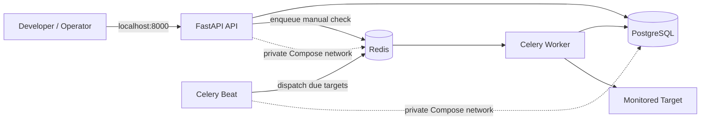
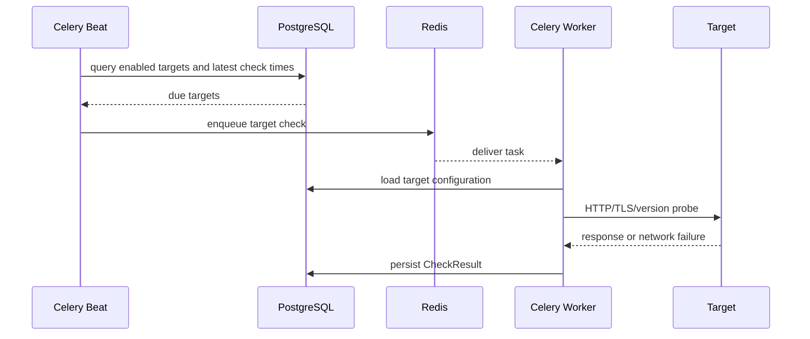
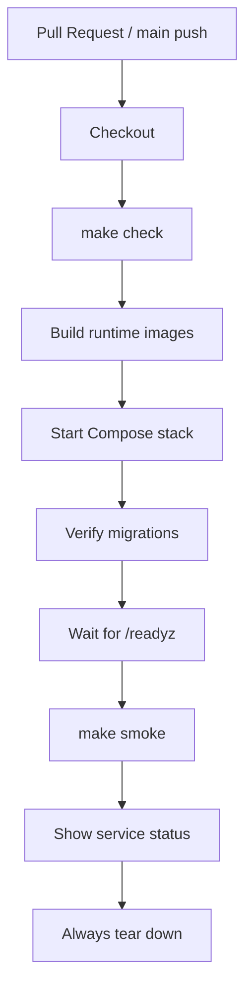

# Ops Appliance Architecture

## Purpose

`ops-appliance` is a deliberately small monitoring application designed to expose meaningful operational boundaries for DevOps and SRE practice.

The application is not intended to compete with mature monitoring products. Its purpose is to demonstrate how a production-style service can be deployed, observed, tested, failed, recovered, and evolved.

## System context

A customer-deployed version of the appliance would sit inside a network and monitor endpoints that may not be reachable from the public internet.

Examples:

- `https://internal-api.customer.local/health`
- `https://portal.customer.local`
- `https://api.customer.local/version`

For v0.1, deterministic local targets such as `http://api:8000/healthz` are used so testing does not depend on external internet access.

## Runtime architecture



## Component responsibilities

| Component | Responsibility | Durable? | Host-published? |
| --- | --- | --- | --- |
| FastAPI API | target management, history, health/readiness, manual check requests | no | yes, `127.0.0.1:8000` |
| PostgreSQL | source of truth for targets and historical check results | yes | no |
| Redis | transient Celery broker and coordination | no | no |
| Celery Worker | executes probes and persists results | no | no |
| Celery Beat | triggers recurring due-target dispatch | no | no |
| Migrate | applies Alembic schema migrations before app startup | no | no |
| Dev container | pytest/Ruff/smoke tooling only | no | no |

## Monitoring flow

A recurring check follows this path:



Manual checks use the same worker path but are initiated by the API instead of the scheduler.

## State and durability

### PostgreSQL is durable state

PostgreSQL stores:

- target definitions
- enabled/disabled state
- monitoring intervals
- expected status codes
- TLS warning thresholds
- optional version URLs
- historical check results

If Redis disappears, this information remains intact.

### Redis is transient infrastructure

Redis is used as a Celery message broker. It coordinates work but is not the source of truth.

v0.1 intentionally configures Redis without persistence. Losing Redis may lose queued work, but it must not erase monitoring configuration or historical results.

This makes the recovery boundary explicit:

```text
Redis loss -> transient work may be lost
PostgreSQL loss -> durable application state is lost
```

## Process isolation

API, worker, and Beat are separate processes even though they share the same runtime image.

That separation is intentional:

- worker failure does not inherently stop the API
- scheduler failure does not inherently stop the worker
- API failure does not erase durable monitoring state
- each process can later be restarted, scaled, or supervised independently

The shared image reduces build duplication without collapsing runtime responsibilities.

## Networking

Compose creates a private bridge network named `backend`.

Default exposure:

```text
Host
  |
  +-- 127.0.0.1:8000 -> API

Private backend network
  +-- PostgreSQL:5432
  +-- Redis:6379
  +-- API:8000
  +-- Worker
  +-- Beat
  +-- Migrate
```

PostgreSQL and Redis are not bound to host ports. This demonstrates the principle that internal data-plane services should not be externally reachable simply because they run in containers.

The host-bound API port is restricted to loopback for v0.1.

## Container design

The custom application image uses a multi-stage Dockerfile.

### `runtime` stage

Used by:

- API
- worker
- Beat
- migration job

Properties:

- pinned Python 3.12 base
- application dependencies only
- non-root UID/GID `10001`
- no pytest or Ruff
- no embedded secrets

### `dev` stage

Used only for on-demand development commands.

Adds:

- tests
- pytest
- pytest-asyncio
- Ruff

This lets a fresh clone run `make check` using Docker without polluting the runtime image with development tooling.

## Health model

### `/healthz` — liveness

Answers:

> Is the API process alive?

A dependency failure should not automatically make liveness fail. Otherwise an orchestrator could repeatedly restart a healthy API process because a database or broker is down.

### `/readyz` — readiness

Answers:

> Can the API perform useful work right now?

PostgreSQL is required for normal API responsibility, so database loss makes the API not ready.

Redis is reported independently. Read-only operations can remain useful while the queue is unavailable, so Redis degradation does not automatically make every API operation unusable.

## Probe semantics

The worker supports:

- HTTP status checks
- latency measurement
- TLS validity checks
- TLS expiration calculation
- optional version endpoint retrieval

Expected failures are normalized as data.

Examples:

| Failure | Worker behavior |
| --- | --- |
| DNS failure | persist failed result |
| timeout | persist failed result |
| connection refused | persist failed result |
| unexpected status | persist failed result |
| invalid/expired TLS | persist failed result |
| version endpoint failure | degrade otherwise healthy result |

Ordinary target failure should not crash the worker process.

## Scheduling semantics

Celery Beat runs a dispatcher once per second.

The dispatcher queries PostgreSQL for targets whose configured interval has elapsed and enqueues each due target through Redis.

The one-second polling interval avoids phase-aliasing problems where a 10-second target could otherwise effectively run every 20 seconds if scheduler ticks and result timestamps were consistently misaligned.

v0.1 accepts at-least-once scheduling semantics. Strong deduplication is intentionally deferred until the project requires it.

## Logging

Application processes write structured JSON logs to stdout.

Common fields:

- `timestamp`
- `service`
- `level`
- `message`

Context fields are allow-listed:

- `target_id`
- `task_id`
- `result_id`
- `error_type`

This makes logs easy to ingest later into Loki or another centralized log platform while reducing the chance of accidentally serializing secrets or arbitrary application state.

## Configuration and secrets

v0.1 uses environment variables and a local `.env` file generated from `.env.example`.

This is appropriate for a local-development release, but it is not the intended production secrets design.

Future appliance releases will separate configuration from secrets and use deployment-specific secret handling.

## CI architecture

GitHub Actions acts as an independent Linux validation environment.



The same Makefile commands used by a developer are reused by CI where practical. This reduces drift between local and automated validation.

## Security posture in v0.1

Implemented:

- non-root application containers
- loopback-only API host binding
- private PostgreSQL and Redis networking
- no committed real secrets
- structured logging with allow-listed context
- bounded network timeouts
- deterministic local smoke target
- explicit service boundaries

Deferred:

- production TLS termination
- authentication/authorization
- hardened secret storage
- image vulnerability scanning
- SBOM generation
- signing and attestations
- firewall policy on a real Linux appliance

## Failure boundaries

| Failure | Expected impact |
| --- | --- |
| Worker stops | API remains available; checks stop executing |
| Beat stops | API and worker remain available; recurring dispatch stops |
| Redis unavailable | queueing fails; durable DB state remains |
| PostgreSQL unavailable | API readiness fails; durable reads/writes unavailable |
| Target unavailable | failed result is persisted; worker stays alive |
| API stops | worker/scheduler processes are not inherently terminated |

These boundaries are intentionally visible because they create useful operational scenarios for later runbooks and failure-injection exercises.

## Why not Kubernetes yet?

Kubernetes is intentionally not part of v0.1.

The project first proves:

- process boundaries
- persistence boundaries
- health semantics
- queueing behavior
- migration behavior
- logs
- tests
- CI

Those application-level concerns remain relevant regardless of orchestrator.

A future Kubernetes implementation would therefore be a deployment evolution rather than a redesign of the monitoring application.

## Release progression

### v0.1 — local vertical slice

Docker Compose, API, PostgreSQL, Redis, Celery, probes, migrations, structured logs, tests, and CI.

### v0.2 — Linux appliance

Ubuntu, Podman, systemd/Quadlet, Ansible, host networking and firewall hardening.

### v0.3 — observability

Prometheus, Grafana, centralized logs, OpenTelemetry.

### v0.4 — reliability operations

Alerting, SLOs, failure injection, runbooks, incident exercises.

### v0.5 — secure delivery

Image scanning, SBOMs, signatures, attestations, improved secrets handling.

### v0.6 — lifecycle operations

Backup/restore, upgrade validation, versioned deployment manifests, rollback.
